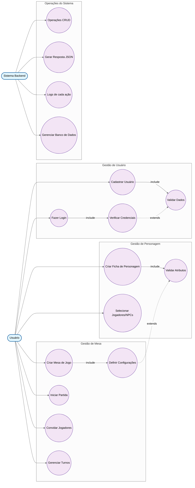

# Diagrama de Casos de Uso - DiceOrDie

## Descrição dos Casos de Uso

### Gestão de Usuário
- **UC1 - Cadastrar Usuário**: Permite ao usuário criar uma nova conta no sistema
- **UC2 - Validar Dados**: Validação de formato de e-mail e senha
- **UC3 - Fazer Login**: Autenticação do usuário no sistema
- **UC4 - Verificar Credenciais**: Verificação das credenciais fornecidas

### Gestão de Personagem
- **UC5 - Criar Ficha de Personagem**: Criação de uma nova ficha de personagem
- **UC6 - Validar Atributos**: Validação dos atributos do personagem (valores 1-20)
- **UC7 - Selecionar Jogadores/NPCs**: Seleção de jogadores e NPCs para a partida

### Gestão de Mesa
- **UC8 - Criar Mesa de Jogo**: Criação de uma nova mesa de jogo
- **UC9 - Definir Configurações**: Configuração das regras e parâmetros da mesa
- **UC10 - Iniciar Partida**: Início efetivo da partida
- **UC15 - Convidar Jogadores**: Convite de outros usuários para participar da mesa
- **UC16 - Gerenciar Turnos**: Controle da ordem e tempo dos turnos durante a partida

### Operações do Sistema
- **UC11 - Operações CRUD**: Operações de Create, Read, Update, Delete
- **UC12 - Gerar Resposta JSON**: Geração de respostas em formato JSON
- **UC13 - Logs de cada ação**: Registro e armazenamento de cada ação realizada no sistema
- **UC14 - Gerenciar Banco de Dados**: Persistência e recuperação de dados

## Relacionamentos
- **include**: Relacionamento obrigatório entre casos de uso (o caso base inclui o comportamento do caso incluído)
- **extends**: Relacionamento opcional onde um caso de uso estende o comportamento de outro (a seta vai do caso que estende para o caso base)
- **→**: Associação direta entre ator e caso de uso
